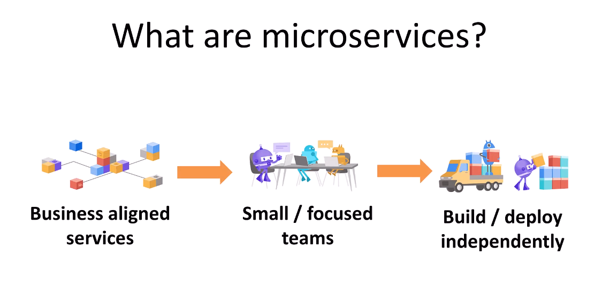
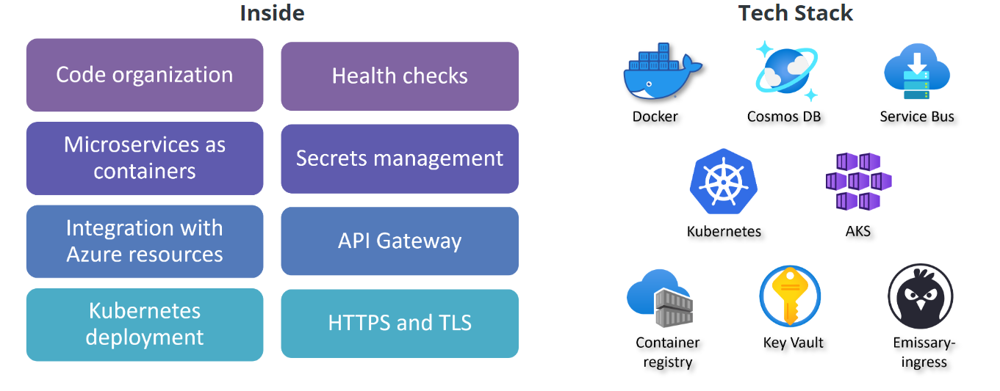
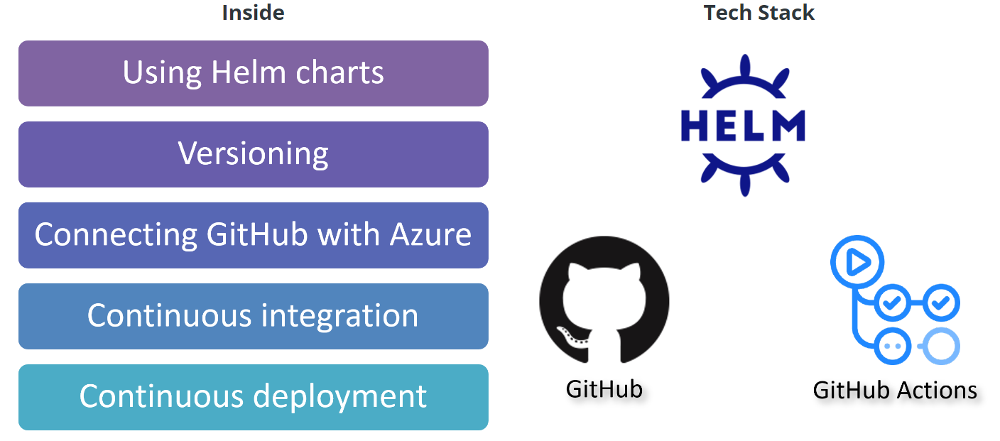
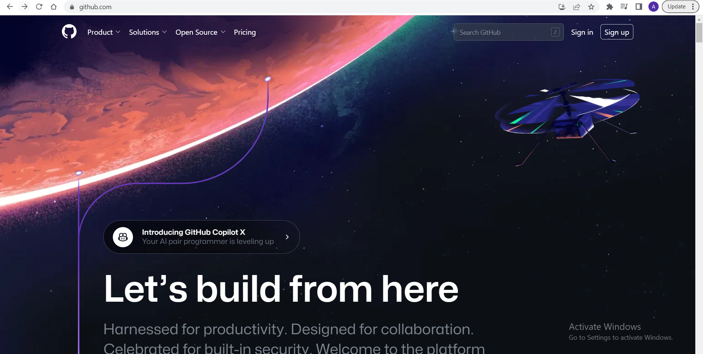
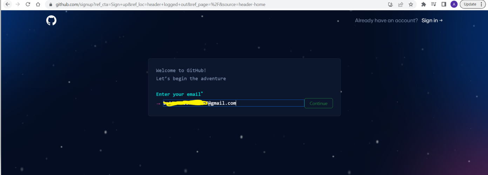
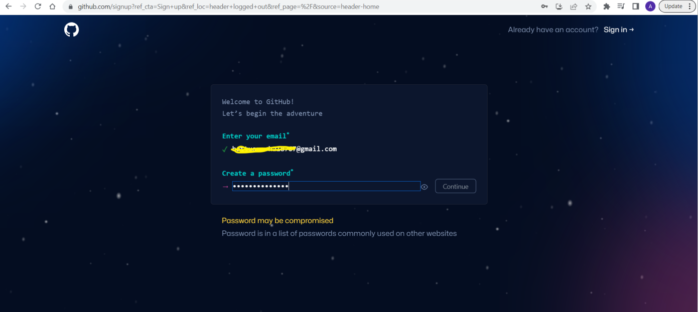
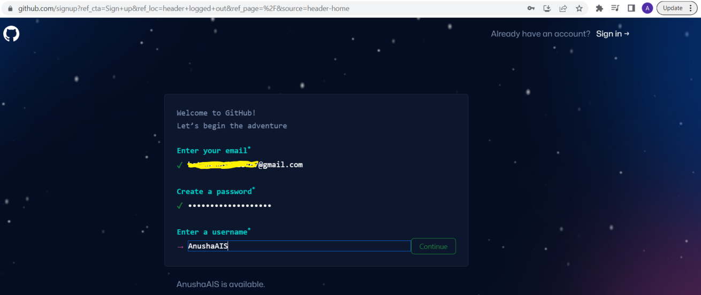
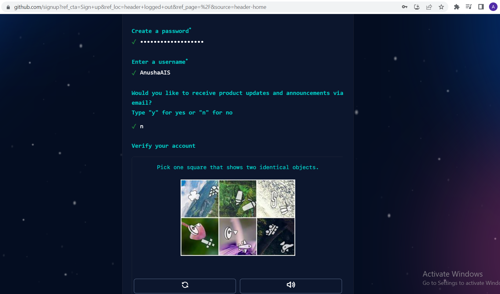

# Introduction to Microservices - Pre-requisites and Setup

### Date Time: 29-Jun-2023 at 09:00 AM IST

## Prerequisites:

N/A

## Software/Tools

N/A

## Languages:

N/A

## Information

## 

## What are we doing today?

> 1. Introduction to Microservices
> 2. Create GitHub account
> 3. Create new GitHub organization
> 4. Create .github repository in the new organization
> 5. Create a new repository called proofofconcepts in the new organization
> 6. Install the basic required software
>    6.1 VS Code
>    6.2 Git Bash
>    6.3 Terminal
>    6.4 GitHub for desktop
> 7. Create new project folder in local drive
> 8. Clone .github and proofofconcepts repositories into new folder using "git clone url"
> 9. Open the project folder in vs code

## 1. Introduction to Microservices

## 2. Create GitHub account

[Github.com](https://github.com/)

## 2. Create new GitHub organization

## 3. Create .github repository in the new organization

## 4. Create a new repository called proofofconcepts in the new organization

## 5. Install the basic required software

## 6. Create new project folder in local drive

## 7. Clone .github and proofofconcepts repositories into new folder using "git clone url"

## 8. Open the project folder in vs code

